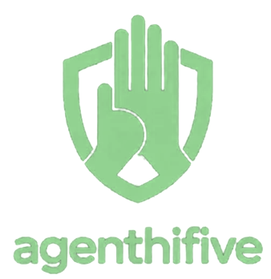

<p align="center">
  
</p>

<h1 align="center">AgentHiFive</h1>

<p align="center">
  <strong>Authority delegation platform for AI agents</strong><br/>
  Connect OAuth accounts. Define policies. Grant scoped, audited access.
</p>

<p align="center">
  <a href="https://github.com/agenthifive/agenthifive/actions/workflows/ci.yml"></a>
  <a href="https://github.com/agenthifive/agenthifive/blob/main/LICENSE"></a>
  <a href="https://discord.gg/VNUj6D2wps"></a>
  <a href="https://www.npmjs.com/package/@agenthifive/agenthifive"></a>
  <a href="https://docs.agenthifive.com"></a>
  <a href="https://github.com/agenthifive/agenthifive"></a>
</p>

---

> Users delegate authority to agents — not hand over credentials.

## What is AgentHiFive?

AgentHiFive sits between your AI agents and the services they need to access. Instead of giving agents your passwords or long-lived API keys, you:

1. **Connect** your accounts (Gmail, Calendar, Teams, Slack, etc.) via OAuth
2. **Create policies** that define what an agent can do (allowlists, rate limits, time windows)
3. **Grant access** to specific agents with specific scopes
4. **Monitor** everything through real-time audit logs
5. **Approve or deny** sensitive actions via step-up approval workflow

### Execution Models

- **Model A (Token Vending):** Agent gets a short-lived access token to call the provider directly
- **Model B (Brokered Proxy):** Agent sends requests through AgentHiFive, which makes the call on behalf of the agent with full policy enforcement

## Quick Start

### SaaS (Recommended)

No servers required — use the hosted platform:

1. Sign up at [app.agenthifive.com](https://app.agenthifive.com)
2. Connect your accounts and configure policies
3. Install the OpenClaw plugin:
   ```bash
   openclaw plugins install @agenthifive/openclaw
   npx @agenthifive/openclaw-setup
   ```

→ [Full SaaS Setup Guide](https://docs.agenthifive.com/getting-started/installation-saas)

### Self-Hosted

```bash
git clone https://github.com/agenthifive/agenthifive.git
cd agenthifive
cp .env.example .env          # Configure encryption key, OAuth credentials
make prereqs                  # Install Node.js 24, pnpm, Docker
make init                     # Install deps, start DB, run migrations
make dev                      # Start web (:3000) + api (:4000)
```

→ [Full Self-Host Guide](https://docs.agenthifive.com/getting-started/installation-selfhost) (includes Docker Compose)

## Supported Integrations

| Category | Providers |
|----------|-----------|
| **Productivity** | Gmail, Google Calendar, Google Drive, Google Docs, Google Sheets, Google Contacts, Outlook Mail, Outlook Calendar, Outlook Contacts, OneDrive, Notion, Trello, Jira |
| **Communication** | Slack, MS Teams, Telegram |
| **AI/LLM** | OpenAI, Anthropic, Google Gemini, OpenRouter |

## Agent Integration

### OpenClaw Plugin

For [OpenClaw](https://github.com/openclaw/openclaw) users:

```bash
openclaw plugins install @agenthifive/openclaw
npx @agenthifive/openclaw-setup
```

→ [Plugin Guide](https://docs.agenthifive.com/openclaw/plugin-guide)

### TypeScript SDK

```typescript
import { AgentHiFiveClient } from '@agenthifive/sdk';

const client = new AgentHiFiveClient({ baseUrl: 'https://your-instance.com' });
const result = await client.vault.execute({
  model: 'B',
  connectionId: 'conn-id',
  method: 'GET',
  url: 'https://gmail.googleapis.com/gmail/v1/users/me/messages',
});
```

### MCP Server

For Claude and other MCP-compatible agents:

```bash
npx agenthifive-mcp --base-url https://your-instance.com --token YOUR_TOKEN
```

## Monorepo Structure

```
apps/
  web/              Next.js 16 static SPA (dashboard UI)
  api/              Fastify 5.x backend (auth, vault, policy engine, audit)
  docs/             Docusaurus documentation site
packages/
  contracts/        Shared Zod schemas and TypeScript types
  security/         AES-256-GCM encryption utilities
  sdk/              Official TypeScript SDK
  oauth-connectors/ OAuth provider adapters (Google, Microsoft)
  openclaw/         OpenClaw Gateway plugin
  agenthifive-mcp/  MCP server (Model Context Protocol)
integration-testing/  End-to-end tests (Docker Compose)
```

## Tech Stack

- **Runtime:** Node.js 24, TypeScript 5.7+ (strict mode)
- **Frontend:** Next.js 16, React 19, Tailwind 4.x
- **Backend:** Fastify 5.x with typed routes
- **Auth:** Better Auth (sessions + JWT via jose/JWKS)
- **Database:** PostgreSQL 15+ (Drizzle ORM, no raw SQL)
- **Validation:** Zod 4.x
- **OAuth:** oauth4webapi
- **Encryption:** AES-256-GCM (quantum-safe)

## Development

```bash
make dev              # Start all dev servers
make test             # Run test suite (212+ tests)
make lint             # Run linter
make typecheck        # TypeScript checks
make migrate          # Apply DB migrations
make db-reset         # Drop + recreate DB
```

## Community

- [Documentation](https://docs.agenthifive.com)
- [Discord](https://discord.gg/VNUj6D2wps)
- [GitHub Issues](https://github.com/agenthifive/agenthifive/issues)

## Contributing

See [CONTRIBUTING.md](CONTRIBUTING.md) for guidelines. PRs welcome!

## Security

See [SECURITY.md](SECURITY.md) for reporting vulnerabilities.

## License

[Apache License 2.0](LICENSE)
